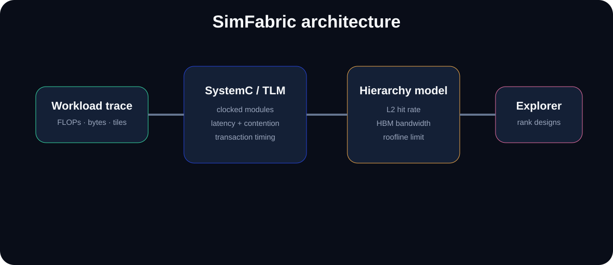

# SimFabric

<p align="center"></p>

<p align="center">
  
  
  
  
</p>

**SystemC/TLM accelerator performance modeling and design-space exploration.**

SimFabric models a tiled accelerator across compute throughput, L2 service, HBM/DRAM bandwidth, arbitration pressure, clock-cycle cost, and empirically observed bandwidth efficiency. The same model is available through a fast Python design-space explorer, a C++ core, and a real SystemC/TLM simulation.

## What is actually implemented

```text
workload
  │
  ├── FLOPs
  ├── bytes moved
  └── tile count
       │
       ▼
 analytical model
  ├── compute service time
  ├── L2 service time
  ├── DRAM service time
  ├── contention penalty
  └── cycle count
       │
       ├──────────────► Python design-space sweep
       │
       └──────────────► SystemC / TLM-2.0
                           │
                     Driver initiator
                           │
                     Accelerator target
                           │
                      HBM target
```

The SystemC path uses real TLM sockets and annotated transaction delay. The TLM hierarchy independently reconstructs memory and compute timing and compares its result against the shared analytical model.

## Build and run

Fast model:

```bash
pip install -e .
simfabric run --tiles 16 --hit-rate 0.65
simfabric sweep
```

SystemC/TLM:

```bash
cmake -S . -B build -G Ninja \
  -DSIMFABRIC_WITH_SYSTEMC=ON \
  -DCMAKE_PREFIX_PATH=/path/to/systemc

cmake --build build
./build/simfabric_systemc
```

## Empirical calibration

The repository contains explicit calibration anchors for two measured GPU workloads:

| Platform | Peak bandwidth | Measured anchor | Efficiency |
|---|---:|---:|---:|
| Tesla T4 | 320 GB/s | 176 GB/s | 55.0% |
| NVIDIA GB10 | 273 GB/s | 231.3 GB/s | 84.7% |

The T4 value is derived from the measured 55% of peak result from the paged-attention work; the GB10 value is the measured 231.3 GB/s peak from the GB10 attention work. These are **calibration anchors**, not independent validation measurements.

Run:

```bash
python tools/correlate.py
```

## CI proves the SystemC path

GitHub Actions does not just lint the source. The `systemc-tlm` job:

1. clones and builds **official SystemC 3.0.2**,
2. installs it into the runner,
3. compiles SimFabric against `SystemC::systemc`,
4. runs the TLM simulation,
5. verifies the TLM/analytical correlation output.

The Python explorer and pure C++ model are tested separately.

## Repository map

```text
include/simfabric/model.hpp   shared C++ model API
src/model.cpp                 hierarchy-aware analytical core
src/systemc_main.cpp          real TLM initiator/target simulation
simfabric/                    Python model + CLI
data/calibration.json         measured T4 / GB10 anchors
tools/correlate.py            empirical calibration report
tests/                        Python + C++ invariants
docs/architecture.svg         architecture diagram
```

## Modeling boundary

SimFabric is a performance model, not an RTL timing signoff tool. Its value is in quickly exploring architectural sensitivity and correlating modeled behavior with measured system data before committing to lower-level implementation.
